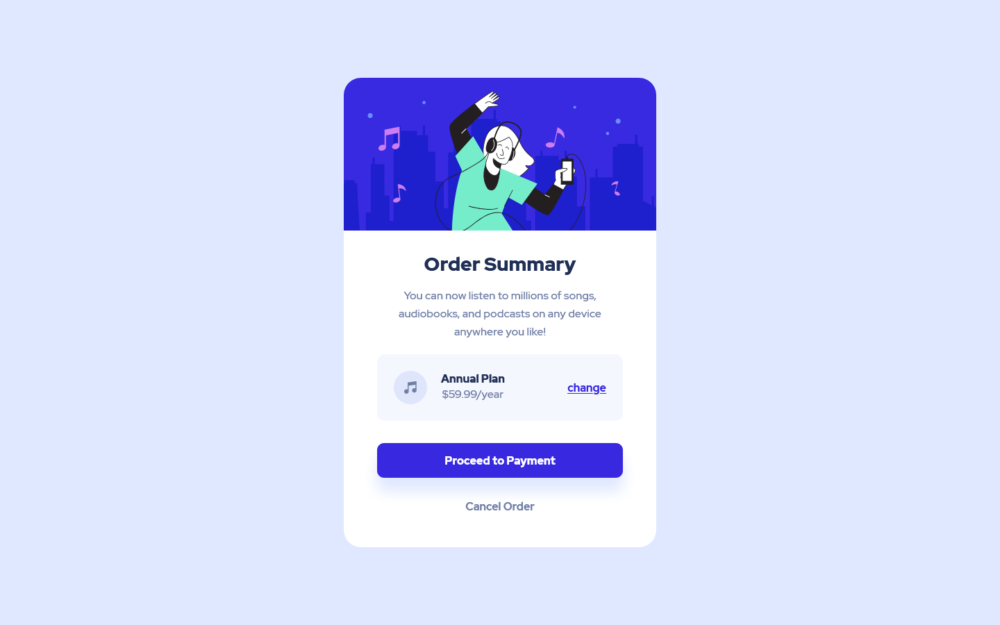
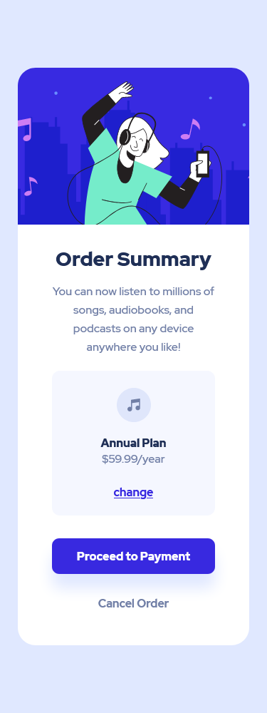

# Frontend - Order summary component

<!-- Summary -->

This is a solution to the [Order summary component](https://www.frontendmentor.io/challenges/order-summary-component-QlPmajDUj). Frontend Mentor challenges help you improve your coding skills by building realistic projects.

## Table of contents

- [Overview](#overview)
  - [The challenge](#the-challenge)
  - [Screenshot](#screenshot)
  - [Links](#links)
- [My process](#my-process)
  - [Built with](#built-with)
  - [What I learned](#what-i-learned)
- [Author](#author)

## Overview

### The challenge

Users should be able to:

- View the optimal layout for the site depending on their device's screen size

### Screenshot

### Links

- Live Site URL: [Live Site URL:](https://suspicious-lovelace-8dc1f6.netlify.app/)
- Solution URL: [Solution URL:](https://www.frontendmentor.io/solutions/order-summary-component-html-css-Ff4o3ABy0)

## My process

### Built with

<!-- Info -->

- Semantic HTML5 markup
- CSS custom properties
- Flex box

### What I learned

- edit 1 : I get a feedback saying that The element "a" must not appear as a descendant of the button element bcz it harms accessibility, and cause an error !Ensure interactive controls are not nested! it was a new thing for me, so I tried another way to make a button behave as a link😊
- edit 2 : I got another feedback about HTML Validations, saying that The element button must not appear as a descendant of the a element, so I am trying new way 😊
- practicing more about using rem it is really helpful more much than px unit

## Author

<!-- - Website -  -->

- Frontend Mentor - [@Rezzak](https://www.frontendmentor.io/profile/errazakallah31)
- Twitter - [@Rezzak_48](https://twitter.com/Rezzak_48)
